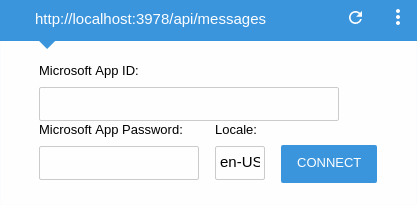
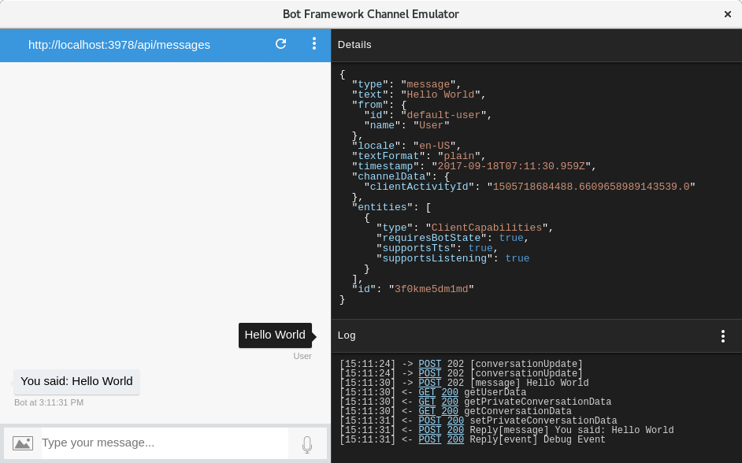

# Basic Chatbot [link to code](./3-2-basicbot.js)
We have previously created a bot that echoes what you say to it, back to you via the console. In this tutorial we will be building a chatbot that you can interact with through the bot framework emulator.

To get started, rename the `app.js` JavaScript file from the previous tutorial and create a new `app.js` file. Type this snippet into your new `app.js` file:  
```
const builder = require('botbuilder');
const express = require('express');
```
> Console bots are good text-based clients, but in order to use any of the Bot Framework channels (or run your bot in the emulator), your bot will need to run on an API endpoint. Express [(reference)](https://expressjs.com/) is a fast and minimalist web framework that allows us to do this. Again, make sure that you have installed the `express` package either through `npm install` or `npm install express --save`.

First, initialize your Express application:  
`const app = express();`
> This creates a simple single-file `express` application. 

Initialize your `connector` using this snippet:  
```
const connector = new builder.ChatConnector({
  appId: process.env.MICROSOFT_APP_ID,
  appPassword: process.env.MICROSOFT_APP_PASSWORD,
});
```
> You may notice that this time we are using the `ChatConnector()` constructor [(reference)](https://docs.botframework.com/en-us/node/builder/chat-reference/classes/_botbuilder_d_.chatconnector.html) instead of `ConsoleConnector`. The `ChatConnector` connects a UniversalBot to multiple channels via the Bot Framework. We also pass in a JavaScript object containing the `appId` and `appPassword`. These are the optional configuration parameters that lets you specify the bot's App ID and Password from the Bot Framework Developer Portal. You may ignore this for now.

Next, type this snippet into your `app.js`:
```
app.listen(3978, () => {
  console.log('Chatbot server started and listening to port 3978');
});
```
> This app starts a server using the `listen()` function [(reference)](https://expressjs.com/en/4x/api.html#app.listen) and listens on port 3978 for connections. We pass in an empty callback function as we only want to log a statement indicating that our server has started successfully. 

Type this line below the `app.listen()`:  
`app.post('/api/messages', connector.listen());`
> The `post()` function [(reference)](https://expressjs.com/en/4x/api.html#app.post.method) routes `HTTP POST requests` to the specified path, in this case `/api/messages`. We pass in the `connector` as the callback function as we want any messages sent to the bot to be handled by the bot framework.

Create the bot as you have previously done:
```
const bot = new builder.UniversalBot(connector, (session) => {
  session.send('You said: %s', session.message.text);
});
```
> The code looks like the same as before, but remember that we are passing in a different `connector` this time, an instance of `ChatConnector`.

--- 

Now you can test out your bot using the emulator!  
1. Start your bot by running `node app.js` in your terminal.
2. Start the `Bot Framework Emulator` application and ensure that it looks like the image below.
    -  
    - Change the URL endpoint to `http://localhost:3978/api/messages`.  
    - Leave the `Microsoft App ID` and `Microsoft App Password` blank for now.  
    
3. Click on `Connect` and type your message in the chatbox below.

If all goes well, your emulator window should look like this:

> The `Bot Framework Emulator` is a powerful tool for helping you develop and debug your chatbot. Notice the chunk of text in the `Details` window? That is the JSON representation [(reference)](https://www.w3schools.com/js/js_json_intro.asp) of the `message` that you sent to the bot. This is one way that you can view the different properties and learn how to access them (such as `session.message.text` as seen above).

---

Now let's give your bot some life by introducing `dialogs`. Chatbots are all about conversations. A bot that is simply echoing back what we said to them is not very useful. Let's start by getting rid of the echobot (it is up to you whether to comment it out or remove it completely) and replacing it with this:  
`const bot = new builder.UniversalBot(connector);`

First, we want to create the `root dialog`, also denoted by `/` as shown below:
```
bot.dialog('/', (session) => {

});
```
> The `root dialog` is the first step in any conversation with your chatbot. The chatbot can route your messages to different `dialogs` based on rules that you set. Currently, this `root dialog` is empty and does nothing.

Let's create a simple greeting dialog where your chatbot asks for your name:
```
bot.dialog('greeting', [
  (session) => {
    builder.Prompts.text(session, `Hello! What's your name?`);
  }, 
  (session, results) => {
    session.userData.name = results.response;
    session.endDialog('Nice to meet you %s', session.userData.name);
  }
]);
```
> There are several new things being introduced here such as the `array of callbacks`, new functions such as `builder.Prompts.text()`, new parameters or properties such as `results` and `session.userData.name`.  
>
> You can think of the `array of callbacks` as a series of steps in a conversation or dialog. The first step is asking the user for their name. The bot then waits for the user's input before proceeding to the next and final step in the dialog which is to end the conversation with 'Nice to meet you'.
>
> The `Prompts.text()` is the bot's way of asking for a text input. We pass in the current `session` as the first argument and the message to be sent to the user regarding this prompt in the second argument.
> 
> `results` is the input from the user after the bot has prompted for it. Here, we access the information we want through the `response` property in `results` and then assign it to the `name` property in the `userData` of the current `session`.

Don't forget to add this into your `root dialog` so that your `greeting dialog` actually runs:
```
bot.dialog('/', (session) => {
  session.beginDialog('greeting');
});
```

Yay! Now we have a greeterbot that you can test out in your emulator. Don't forget to restart your chatbot (first, stop it using `ctrl + c`, then run it again using `node app.js`) to see your updated changes.

Check out the rest of the code [here](./3-2-basicbot.js) to see how you can make your bot remember your name :smile: